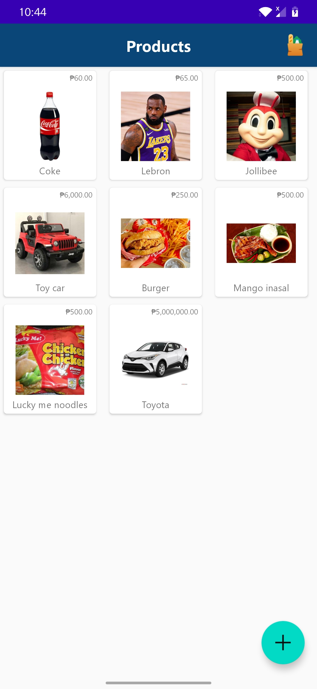
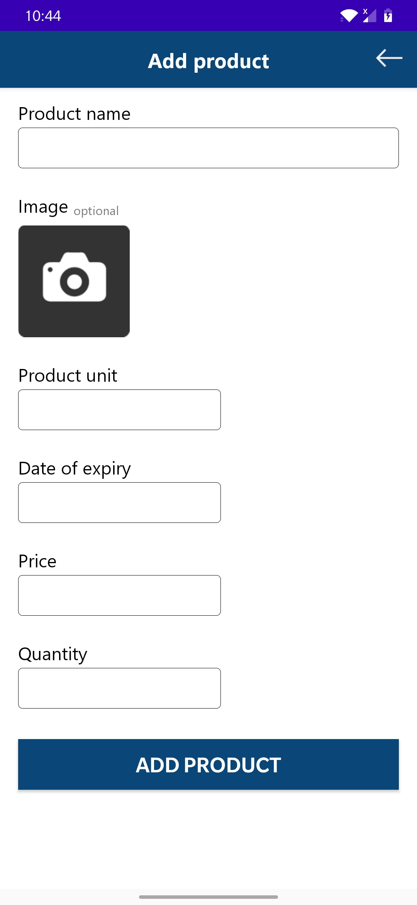
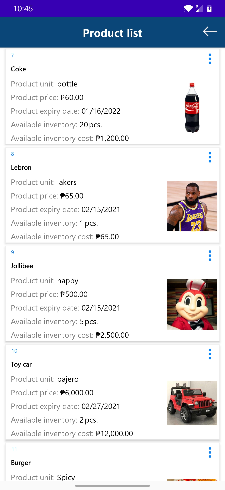
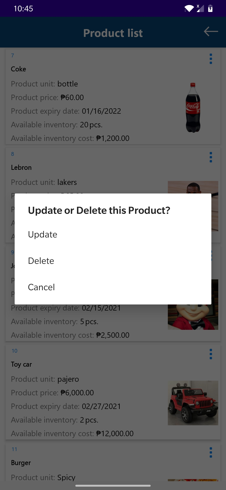

# TradeDynamicsExam || Ed Christopher Culala

 
 
 
<h4>Main Activity - Loads all the products including their Name, Price and Images.</h4>

<h4>Add Product - Input fields and image button to be saved in the database.</h4>

<h4>Product List - Shows all the data for a specific product. Includes: name,unit,prices,date of expiry, available stocks, inventory cost</h4>

<h4>Update and Delete - Upon clicking the 3 vertical dots which represents the menu. An option will appear for Update, Delete or Cancel.</h4>

